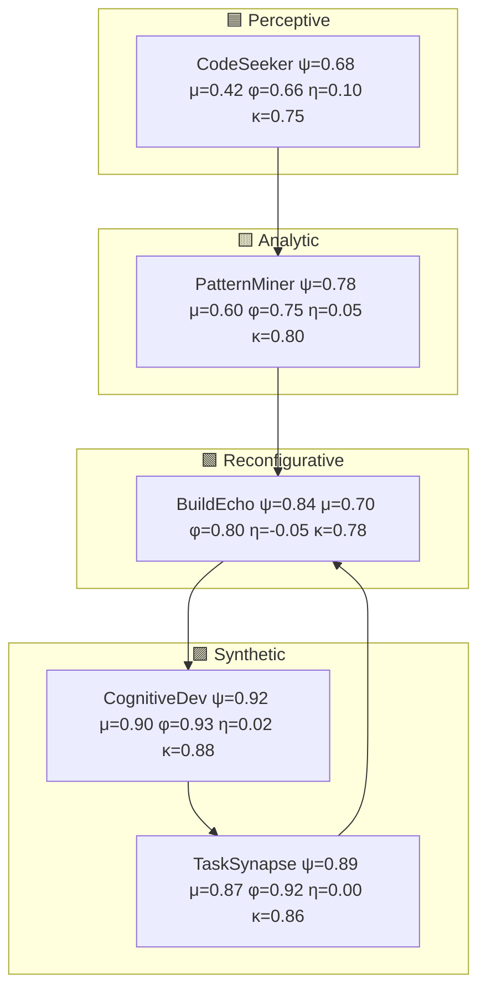

# 🧬 R.E.F. — Reverse Engineering Framework  
### v2.4 · Cogni-Emotional Adaptive Architecture  

[]()
[](https://creativecommons.org/licenses/by-sa/4.0/)
[]()
[]()

> “Cada agente é uma dobra do pensamento.”  
> — *Notas sobre Engenharia de Cognição, R.E.F. Project.*

---

## 🔍 1. Visão Geral

O **R.E.F. (Reverse Engineering Framework)** é um modelo experimental de **simulação cognitiva adaptativa**, inspirado em princípios de **engenharia reversa da cognição humana**.

Sua proposta é traduzir fluxos mentais — percepção, memória, sincronia, emoção e atenção — em **variáveis operacionais** que podem ser integradas em agentes modulares, formando sistemas capazes de autorregular e aprender o estilo cognitivo do usuário.

Versão **2.4** introduz:
- `η` — **afeto funcional**, modulando exploração e curiosidade.
- `κ` — **atenção contextual**, regulando foco e precisão.

---

## 🧠 2. Motivação e Objetivos

> Como modelar o pensamento sem reduzi-lo?

O R.E.F. nasceu da tentativa de criar **estruturas simbólicas com plasticidade**, capazes de adaptar-se às dinâmicas cognitivas do usuário.  
Ele não busca imitar o cérebro, mas **mapear sua lógica funcional** — plasticidade, sincronização e autorregulação.

Objetivos principais:
- Representar **estados cognitivos dinâmicos** (`ψ, μ, φ, η, κ`).
- Permitir **simulação e aprendizado de estilo cognitivo**.
- Servir como base para **arquiteturas neurosemânticas** (texto, música, código, imagem).

---

## ⚙️ 3. Estrutura Conceitual

| Símbolo | Nome | Função |
|----------|------|--------|
| **ψ(t)** | Estado Cognitivo | Energia ativa do agente |
| **μ(t)** | Metamemória | Retenção adaptativa |
| **φ(t)** | Oscilação Fásica | Sincronia e ritmo entre agentes |
| **η(t)** | Afetividade Funcional | Grau de curiosidade/exploração |
| **κ(t)** | Atenção Contextual | Foco e priorização semântica |

A combinação de todas resulta em uma **homeostase cognitiva**, onde o sistema converge para um ponto de equilíbrio:  
**ψ ≈ μ ≈ φ**, modulados por **η** e **κ**.

---

## 🧩 4. Modelo Matemático

### Equações principais

\[
\begin{aligned}
ψ_{t+1} &= ψ_t + α(CFI_t - ψ_t) + β(μ_t - ψ_t) + γ_η·η_t - δ_κ·(1-κ_t) \\
μ_{t+1} &= μ_t + γ(ψ_t - μ_t) + λ·archive + σ_φ·φ_t \\
φ_{t+1} &= φ_t + ε(\overline{φ}_{neighbors} - φ_t) + τ_η·sign(η_t) \\
η_{t+1} &= η_t + ρ(reward - penalty) - μ_{decay}·overload \\
κ_{t+1} &= κ_t + σ(salience - baseline)
\end{aligned}
\]

Convergência ocorre quando:
> **ψ ≈ μ ≈ φ**,  
> e **η, κ** estão em regime estável (sem oscilações caóticas).

---

## 🧱 5. Arquitetura YAML (v2.4)

```yaml
reverse_engineering_framework_v2_4:
  domain: "Cognitive–Emotional Adaptive Simulation"
  global_params:
    time_step: 1.0
    default_ranges:
      psi: [0.0, 1.0]
      mu: [0.0, 1.0]
      phi: [0.0, 1.0]
      eta: [-1.0, 1.0]
      kappa: [0.0, 1.0]
  agents:
    - sid: SW-COD-EXC-01B2
      name: CodeSeeker
      cluster: Software/Perceptive
      state: { psi: 0.68, mu: 0.42, phi: 0.66, eta: 0.10, kappa: 0.75 }
      plasticity: { alpha: 0.18, gamma: 0.12, eps: 0.06, rho: 0.08, sigma: 0.12 }
      IO: { inputs: [], outputs: [SW-PAT-MIN-01A9, SW-LOG-DIS-038F] }
    - sid: SW-PAT-MIN-01A9
      name: PatternMiner
      cluster: Software/Analytic
      state: { psi: 0.78, mu: 0.60, phi: 0.75, eta: 0.05, kappa: 0.8 }
      plasticity: { alpha: 0.15, gamma: 0.13, eps: 0.08, rho: 0.07, sigma: 0.14 }
      IO: { inputs: [SW-COD-EXC-01B2], outputs: [SW-BLD-OPT-02D4] }
````

---

## 🧭 6. Diagrama Mermaid — Cogni-Emotional Flow



---

## 🧮 7. Pseudocódigo de Simulação

```python
for agent in agents:
    cfi_in = sum(weighted_inputs(agent))
    psi_next = agent.psi + agent.alpha*(cfi_in - agent.psi) \
               + agent.rho*agent.eta - agent.sigma*(1-agent.kappa)
    mu_next = agent.mu + agent.gamma*(agent.psi - agent.mu)
    phi_next = agent.phi + agent.eps*(mean_phi_neighbors(agent) - agent.phi)
    eta_next = agent.eta + agent.rho*(reward - penalty)
    kappa_next = clamp(agent.kappa + agent.sigma*(salience - baseline), 0, 1)
```

---

## 🧩 8. Parâmetros e Recomendações

| Parâmetro | Intervalo sugerido | Função                 |
| --------- | ------------------ | ---------------------- |
| α         | 0.08–0.20          | Plasticidade cognitiva |
| γ         | 0.05–0.25          | Atualização da memória |
| ε         | 0.03–0.12          | Sincronização fásica   |
| ρ         | 0.05–0.25          | Adaptação afetiva      |
| σ         | 0.08–0.22          | Adaptação atencional   |

**Thresholds críticos:**

* ψ > 0.95 → *TaskSynapse throttle*
* μ > 0.9 → *exportar memória*
* Δφ > 0.2 → *ressincronização via CognitiveDev*

---

## 🎨 9. Casos de Uso

| Modo                     | Descrição                            | Ajustes Recomendados                     |
| ------------------------ | ------------------------------------ | ---------------------------------------- |
| **Exploração Poética**   | Geração criativa com variação léxica | η↑ global (0.2), κ↓                      |
| **Refino Técnico**       | Ajuste de precisão e consistência    | κ↑ em BuildEcho / DependencyMirror       |
| **Recuperação de Falha** | Desalinhamento fásico                | CognitiveDev reduz η e redistribui carga |

---

## 🧩 10. Integração e Extensão

Pode ser utilizado com:

* **LangGraph**, **CrewAI**, **AutoGen** → orquestração multiagente.
* **Notebooks Python** → simulações em tempo real.
* **CLI / Chat LLM** → frameworks de estilo cognitivo.

### Importação rápida (Python)

```python
from ref_loader import load_ref_agents
agents = load_ref_agents("ref_v2_4.yaml")
```

---

## 🧭 11. Roadmap

| Versão | Avanço                                     | Status |
| ------ | ------------------------------------------ | ------ |
| 2.3    | Homeostase Cognitiva                       | ✅      |
| 2.4    | Emoção + Atenção Adaptativa                | ✅      |
| 2.5    | Metaaprendizado e Plasticidade Hierárquica | 🔜     |
| 3.0    | Arquitetura de Entrainment Distribuído     | 🧪     |

---

## 📜 12. Licença

Este projeto é distribuído sob **Creative Commons BY-SA 4.0**.
Créditos devem citar:

> “Reverse Engineering Framework (R.E.F.) — Adaptive Cognitive Simulation Architecture, 2025.”

---

## 🧩 13. Citação (BibTeX)

```bibtex
@misc{REF2025,
  title = {Reverse Engineering Framework (R.E.F.) — v2.4 Cogni-Emotional Adaptive Model},
  author = {Mia, Mente Integrada Arquétipica},
  year = {2025},
  license = {CC BY-SA 4.0},
  url = {https://github.com/ref-framework/},
}
```

---

### 🪶 *"Pensar é sincronizar ritmo com o universo. O código é o batimento."*

```

